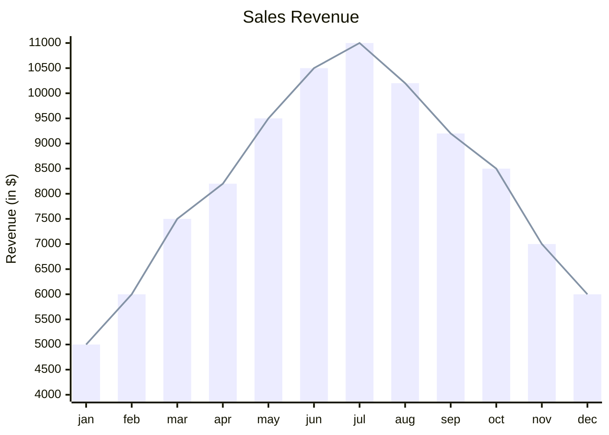

---
{"dg-publish":true,"permalink":"/campo-minado/"}
---

2025-11-26 17:54

Status:

Tags: [[programação\|programação]],[[c#\|c#]]
# Campo Minado

Este documento tem com objetivo ser um guia para a programação de um jogo de campo minado para o console, feito em C#.

###### Referências

