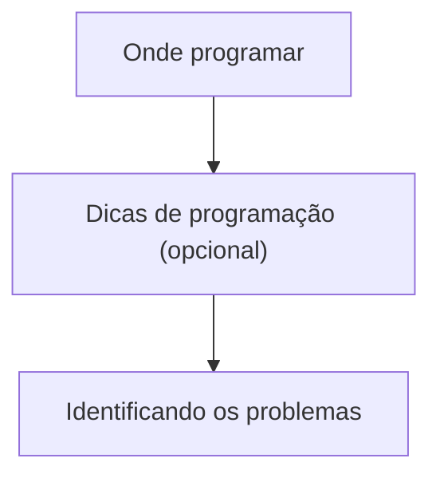

---
{"dg-publish":true,"permalink":"/campo-minado/campo-minado/"}
---

2025-11-26 17:54

Status:beta

Tags: [[programação\|programação]],[[c#\|c#]]
# Campo Minado

Este documento tem com objetivo ser um guia para a programação de um jogo de campo minado para o console, feito em C#.

|     | [[Campo Minado/Onde programar\|Onde programar?]]                                       |     |
| --- | ------------------------------------------------------------------------- | --- |
|     | [[Dicas de programação\|Dicas de programação (opcional)]]                 |     |
|     | [[Campo Minado/Identificando os problemas (campo minado)\|Identificando os problemas]] |     |

###### Referências

